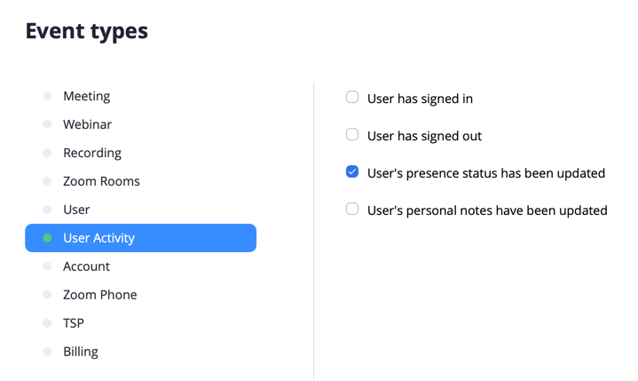

# Homebridge Zoom Plugin

This plugin exposes your Zoom meeting status as a Homekit switch accessory. When in a meeting the switch is on, when out of a meeting the switch is off. Science.

This extremely work-in-progress plugin should not be used by anyone, and requires you to set up a webhook-only Zoom app in your account, as well as expose an endpoint which can be called by Zoom.

## Setup

Difficulty: Medium

* Obtain a public address for the plugin's Zoom endpoint (default `localhost:9666`, though the port can be configured in the settings). As per Zoom's documentation, this is required to be a HTTPS endpoint. This could be done using:
  * ngrok. Good for proof of concept, paid plan required for a reserved URL
  * Static IP and port forwarding. SSL support is a work in progress (#1), or you could use a reverse proxy if you're into that sort of thing
* Set up a Zoom app
  * Create a new [webhook-only Zoom application](https://marketplace.zoom.us/docs/guides/build/webhook-only-app) 
  * Add an event subscription for "User's presence status has been updated"
  
  * Update the **Event notification endpoint URL**
* Install and configure the plugin
